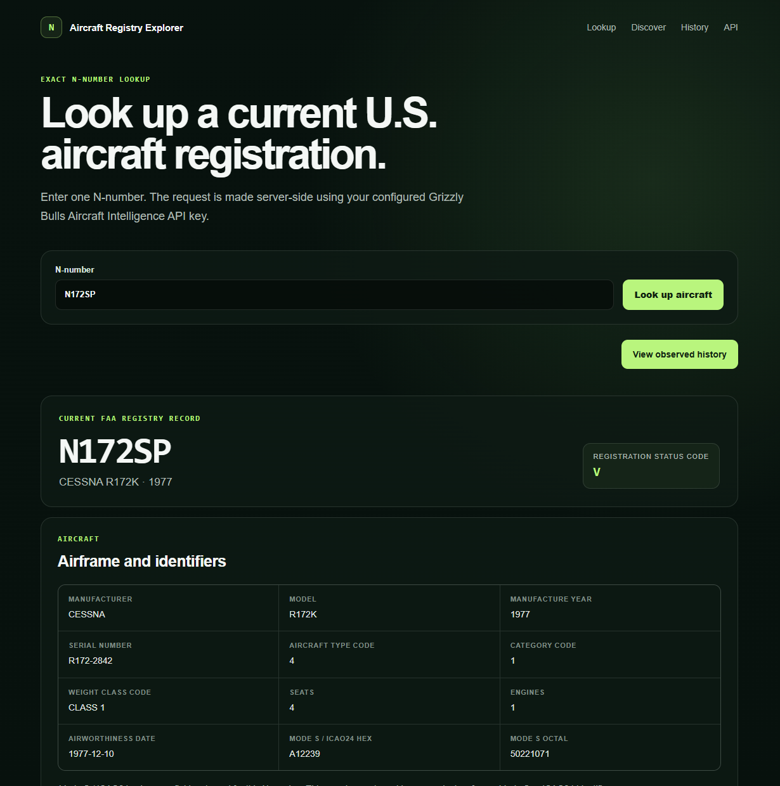
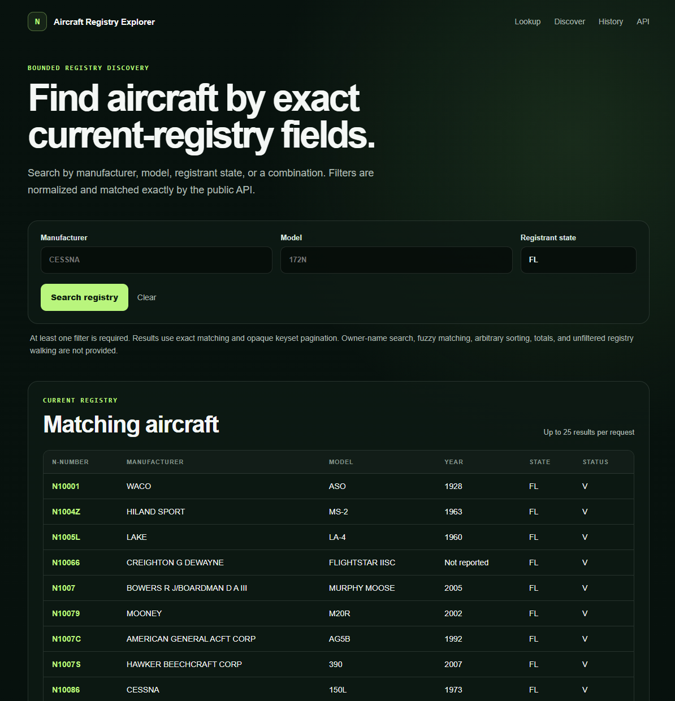
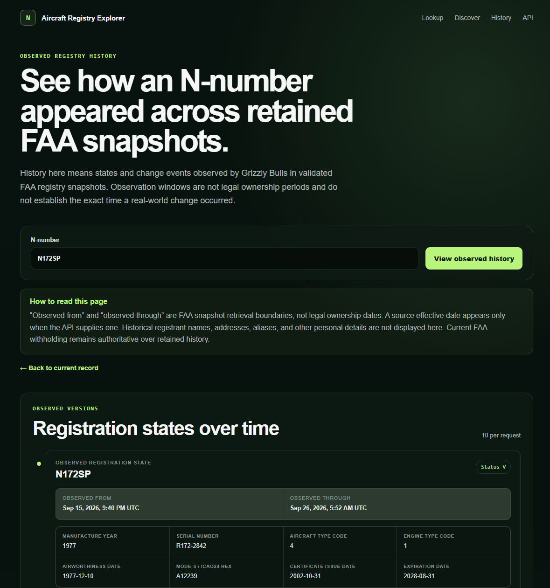

# Aircraft Registry Explorer

Aircraft Registry Explorer is an open-source Next.js reference application for the [Grizzly Bulls Aircraft Intelligence API](https://grizzlybulls.com/aircraft-api).

**[Try the live demo](https://aircraft-demo.grizzlybulls.com)** or clone the repository and run the same integration locally with your own API key.

It shows how to build against current U.S. FAA aircraft registration data without downloading, normalizing, storing, or serving the FAA bulk registry yourself.

The application uses the same public API contract available to any developer. It does not import private Grizzly Bulls code, connect to Grizzly Bulls databases, or maintain a second aircraft-data source of truth.

## Product tour

### Current N-number lookup



### Bounded registry discovery



### Observed registry history



## Five-minute quickstart

You need:

- Node.js 24
- pnpm 11
- a Grizzly Bulls Aircraft Intelligence API key

Create a free API key from the [Aircraft Intelligence API page](https://grizzlybulls.com/aircraft-api), then:

```bash
git clone https://github.com/Grizzly-Bulls/aircraft-registry-explorer.git
cd aircraft-registry-explorer
pnpm install
cp .env.example .env.local
```

Add the key to `.env.local`:

```bash
GRIZZLY_BULLS_API_KEY=your_key_here
```

Start the app:

```bash
pnpm dev
```

Open [http://localhost:3000](http://localhost:3000).

Try these six workflows:

1. **Lookup:** open `/lookup` and enter an exact U.S. N-number.
2. **ICAO24:** open `/icao24` and resolve one exact six-digit Mode S / ICAO24 hex value.
3. **Lifecycle status:** open `/status` and inspect registered, reserved, deregistered, or unknown N-number evidence.
4. **Changes:** open `/changes` to inspect a bounded recent observation-time change-feed sample with privacy-safe diffs.
5. **Discover:** open `/discover` and search the current registry with supported exact filters.
6. **History:** open `/history` and enter an N-number to inspect retained observed versions and PII-free change events.

The machine-readable API contract is available as [OpenAPI 3.1](https://api.grizzlybulls.com/v1/openapi).

## What the app demonstrates

The reference app supports:

- exact U.S. N-number lookup;
- exact current ICAO24 / Mode S lookup;
- N-number lifecycle status across registered, reserved, deregistered, and unknown states;
- bounded recent observed changes with privacy-safe before/after diffs;
- bounded current-registry discovery by supported exact filters;
- current aircraft, engine, airworthiness, registration, and returned Mode S / ICAO24 fields;
- source freshness and provenance alongside current records;
- opaque keyset pagination for discovery;
- click-through from discovery into the current N-number record;
- retained observed registration versions with explicit observation-window boundaries;
- PII-free retained change events with source provenance; and
- independent bounded pagination for observed versions and change events.

It does **not** provide owner-name reverse search, ICAO24 ranges, global registry coverage, flight tracking or live ADS-B positions, bulk registry export, fuzzy search, arbitrary discovery sorting, registry totals, or an unfiltered registry walk.

## Architecture

The browser never receives the Aircraft API key. The hosted demo uses a dedicated first-party server credential behind additional per-client and global abuse limits; local clones use the developer's own server-side key.

```text
browser
  |
  | GET /lookup, /icao24, /status, /changes, /discover, or /history
  v
Next.js server-rendered page
  |
  | Authorization: Bearer <server-only API key>
  v
https://api.grizzlybulls.com/v1
```

`GRIZZLY_BULLS_API_KEY` is read only by the server-side API adapter under `src/lib/`. Browser code does not call `api.grizzlybulls.com` directly. Browser CORS is intentionally not enabled.

The repository has no aircraft database, account system, background worker, FAA ingestion pipeline, or private Grizzly Bulls dependency.

### Hosted demo boundary

The live demo at [aircraft-demo.grizzlybulls.com](https://aircraft-demo.grizzlybulls.com) runs this repository as a server-side application. Its dedicated Grizzly Bulls demo credential is injected only into the server runtime and is never sent to browser code.

Hosted mode also applies lower application-side abuse limits before a request reaches the Aircraft API. The machine API independently applies a higher first-party demo ceiling. Demo traffic does not consume a customer monthly quota and is not treated as customer API adoption.

The hosted app exposes no generic proxy route: visitors can use only the same exact lookup, ICAO24, lifecycle-status, recent-change, bounded-discovery, and observed-history workflows implemented in this repository.

## Public API examples

These are direct machine-API examples. Keep the API key on a server, command line, or other trusted environment.

### Exact N-number lookup

```bash
curl --fail-with-body \
  -H "Authorization: Bearer $GRIZZLY_BULLS_API_KEY" \
  -H "Accept: application/json" \
  "https://api.grizzlybulls.com/v1/aircraft/N12345"
```

### Exact ICAO24 / Mode S lookup

```bash
curl --fail-with-body \
  -H "Authorization: Bearer $GRIZZLY_BULLS_API_KEY" \
  -H "Accept: application/json" \
  "https://api.grizzlybulls.com/v1/aircraft/icao24/A12239"
```

### N-number lifecycle status

```bash
curl --fail-with-body \
  -H "Authorization: Bearer $GRIZZLY_BULLS_API_KEY" \
  -H "Accept: application/json" \
  "https://api.grizzlybulls.com/v1/aircraft/n-number/N172SP/status"
```

The status resolver returns reviewed `registered`, `reserved`, `deregistered`, or `unknown` evidence. `unknown` does **not** mean available; the API deliberately reports `availability: "not_determined"`.

### Recent observed changes

```bash
curl --fail-with-body \
  -H "Authorization: Bearer $GRIZZLY_BULLS_API_KEY" \
  -H "Accept: application/json" \
  "https://api.grizzlybulls.com/v1/aircraft/changes?since=2026-09-29T00%3A00%3A00.000Z&until=2026-09-30T00%3A00%3A00.000Z&limit=20"
```

The change feed uses observation-time windows and reviewed privacy-safe diffs. It does not infer sales, legal ownership transfers, or exact real-world transaction times.

### Bounded current-registry discovery

At least one of `manufacturer`, `model`, or two-letter `state` is required. Filters use exact normalized matching and combine with AND semantics.

```bash
curl --fail-with-body \
  -H "Authorization: Bearer $GRIZZLY_BULLS_API_KEY" \
  -H "Accept: application/json" \
  "https://api.grizzlybulls.com/v1/aircraft?manufacturer=CESSNA&model=172N&state=FL&limit=25"
```

If the response returns `pagination.nextCursor`, pass that opaque cursor with the same filters for the next page. Do not decode it or infer a registry total from it.

### Retained observed history

Versions and events have independent bounded pagination.

```bash
curl --fail-with-body \
  -H "Authorization: Bearer $GRIZZLY_BULLS_API_KEY" \
  -H "Accept: application/json" \
  "https://api.grizzlybulls.com/v1/aircraft/N12345/history?versionsLimit=10&versionsOffset=0&eventsLimit=10&eventsOffset=0"
```

### Server-side TypeScript

The application follows the same pattern as this minimal example:

```ts
const response = await fetch(
  "https://api.grizzlybulls.com/v1/aircraft/N12345",
  {
    headers: {
      Accept: "application/json",
      Authorization: `Bearer ${process.env.GRIZZLY_BULLS_API_KEY}`,
    },
    cache: "no-store",
  },
);

if (!response.ok) {
  throw new Error(`Aircraft API request failed: ${response.status}`);
}

const { data } = await response.json();
console.log(data.registration.nNumber);
```

For the complete request and response contract, use the [OpenAPI document](https://api.grizzlybulls.com/v1/openapi).

## Discovery semantics

The reference app keeps discovery deliberately simple:

- at least one of manufacturer, model, or two-letter registrant state is required;
- manufacturer, model, and state filters are normalized and matched exactly;
- combined filters use AND semantics;
- this app requests up to 25 records at a time;
- pagination uses the opaque `nextCursor` returned by the API; and
- a cursor is reused only with the same discovery filters.

The machine API also supports reviewed exact serial-number, manufacture-year, and registration-status filters. This reference UI does not need to expose every supported filter to demonstrate bounded discovery. The application does not decode cursors or infer page numbers or registry totals.

## History semantics

The `/history` page consumes the public retained-history endpoint without creating a second history model.

`observedFrom` and `observedThrough` are snapshot retrieval boundaries. They show when Grizzly Bulls observed a state in validated FAA registry data. They are not legal ownership periods and do not establish the exact time a real-world registration change occurred. An observed interval does not prove the exact date of a real-world registration or ownership change.

Change events use the API's reviewed PII-free event vocabulary. A source effective date is shown only when the API supplies a non-null `sourceEffectiveDate`. The application does not infer one from observation timestamps.

Observed versions and change events have independent pagination authorities. Moving through one list preserves the current offset of the other list.

The history UI deliberately does not display retained registrant names, street addresses, aliases, postal information, or other personal details. Current FAA public withholding remains authoritative over retained history, and the app does not attempt to reconstruct suppressed information.

## Data interpretation

FAA registration data identifies the public registrant record. It is not proof of beneficial economic ownership.

Mode S / ICAO24 values shown on an N-number lookup are also usable through the dedicated exact ICAO24 route. That route resolves current FAA registry identity only; it is not a live transponder-position or flight-tracking service.

This project is an API integration example, not a global aviation registry, flight tracker, legal ownership ledger, or unrestricted public registry-search service.

## Screenshots

Repository screenshots must be real captures from this application, not mock aircraft records or generated imagery. The reviewed set is `lookup.png`, `discover.png`, and `history.png` under `docs/screenshots/`. See [docs/screenshots/README.md](./docs/screenshots/README.md) for the capture and privacy checklist.

For distribution screenshots, prefer the live hosted application after its server-only credential and abuse controls are verified.

## Contributing

See [CONTRIBUTING.md](./CONTRIBUTING.md) before opening an issue or pull request. The project intentionally keeps a narrow public API, privacy, and server-only-secret boundary.

Before opening a pull request:

```bash
pnpm check
git status --short
```

The final status should be clean.

## Links

- [Live demo](https://aircraft-demo.grizzlybulls.com)
- [Aircraft Intelligence API](https://grizzlybulls.com/aircraft-api)
- [OpenAPI 3.1 contract](https://api.grizzlybulls.com/v1/openapi)
- [Grizzly Bulls](https://grizzlybulls.com)
- [Contributing guide](./CONTRIBUTING.md)
- [MIT license](./LICENSE)

## License

MIT. See [LICENSE](./LICENSE).
